# Enterprise Document & Records Management System (DRMS)
## Solution Proposal

**Prepared for:** Senior Management, IT Leadership & Procurement
**Prepared by:** Solution Architecture Team
**Document status:** Proposal for approval of a discovery & implementation project

> **Note on figures:** This proposal deliberately avoids inventing organisation-specific numbers. All quantities (document volumes, user counts, costs, retrieval times) appear as clearly labelled **assumptions** or **configurable placeholders**. They are intended to be replaced with real figures during the discovery phase.

---

## 1. Executive Summary

The organisation manages a large and growing volume of business-critical documents that are still predominantly **physical** — printed, filed, and stored across cabinets, shelves, boxes, and records rooms spanning multiple departments. This creates measurable, recurring costs: time lost searching for documents, risk of misfiled or lost records, limited access control, and no reliable audit trail of who accessed or moved a document.

We propose a centralised **Enterprise Document & Records Management System (DRMS)** that bridges the physical and digital worlds. Documents scanned from existing multifunction printers are automatically ingested, virus-scanned, OCR-processed, classified, and made **searchable by their actual contents**. Every document retains a link to its **physical storage location**, and every physical movement — checkout, transfer between departments, and return — is tracked with a complete, tamper-evident history.

The platform is built on **Laravel** (the proven application and business-logic layer) with **Laravel Nova** providing a secure, enterprise-grade management interface. This is not an "admin panel" — Laravel delivers the workflow engine, ingestion services, integrations, and APIs, while Nova gives records managers, custodians, and administrators a polished operational console.

The result is a single source of truth for organisational records that improves **productivity, security, compliance, accountability, and business continuity** — and provides a foundation that can evolve toward intelligent, automated document processing.

**What we are asking for:** approval to begin a structured discovery and MVP delivery, starting with a single pilot department.

---

## 2. Current Challenges

| Area | Current State | Business Impact |
|------|--------------|-----------------|
| Retrieval | Documents located manually in cabinets, boxes, rooms | Staff time lost; slow response to queries and audits |
| Storage | Physical filing across multiple locations | Ongoing space, printing, and administration costs |
| Security | Physical access is hard to control | Sensitive records exposed to unauthorised access |
| Tracking | No record of who has a document or where it moved | Accountability gaps; documents "disappear" |
| Auditability | No reliable log of access or movement | Difficult to satisfy compliance and investigations |
| Loss & damage | Vulnerable to misfiling, loss, deterioration | Business risk; irreplaceable records |
| Digital access | Ad-hoc manual scanning on demand | Duplicated effort; inconsistent quality |
| Searchability | Search by physical browsing only | Cannot find documents by their contents |

The core problem: **the organisation cannot quickly, securely, or verifiably find, control, and account for its own records.**

---

## 3. Vision and Objectives

**Vision:** Transform the organisation's records from scattered physical files into a secure, searchable, auditable **Enterprise Digital Records Platform** — while never losing track of the physical originals that must be retained.

**Objectives:**

1. Digitise documents at the point of scanning, automatically.
2. Make every document findable by its contents, metadata, and physical location.
3. Preserve and manage the link between digital records and their physical originals.
4. Control access by role, department, and document sensitivity.
5. Maintain a complete, tamper-evident audit trail across the document lifecycle.
6. Provide a platform that scales from a single pilot department to organisation-wide use, and can later support intelligent document processing.

---

## 4. Proposed Solution

A centralised DRMS combining digital document management with physical records tracking.

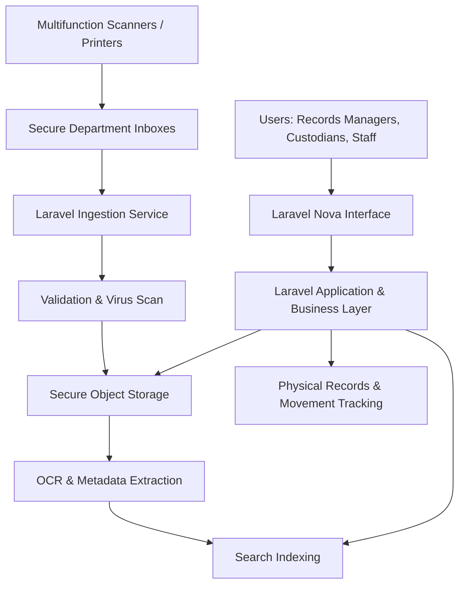

### Why Laravel and Nova

| Layer | Technology | Role |
|-------|-----------|------|
| Business/application logic | **Laravel** | Ingestion services, workflow engine, retention rules, integrations, REST APIs, queue-driven processing |
| Management interface | **Laravel Nova** | Secure operational console for records managers and administrators — resources, filters, dashboards, actions |
| Asynchronous processing | **Redis + Queues + Horizon** | OCR, indexing, and virus scanning run in the background without blocking users |
| Data | **MySQL/PostgreSQL** | Structured metadata, relationships, audit records |
| Content | **Secure object storage** | Encrypted document files |
| Search | **MySQL FT → OpenSearch/Elasticsearch** | Full-text search over document contents |

Laravel is a mature, widely adopted enterprise PHP framework with first-class support for queues, events, scheduling, security, and API development — exactly the capabilities an ingestion-and-workflow platform depends on. Nova sits **on top of** that business layer to provide a professional interface, so the organisation is never locked into a single UI. The same Laravel logic can later power a mobile app or third-party integrations without rewriting business rules.

---

## 5. Solution Architecture

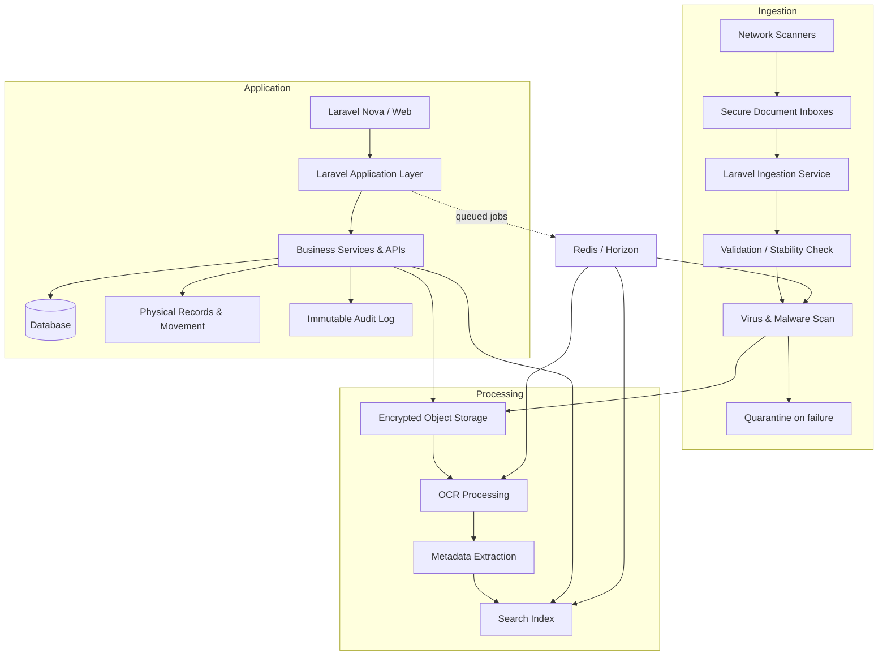

**Component purposes:**

- **Secure Document Inboxes** — per-department drop zones (SMB/SFTP) where scanners deposit files.
- **Ingestion Service** — detects new files, verifies they are fully written, and enqueues processing.
- **Validation & Virus Scan** — enforces file-type rules and scans every file; failures go to a **quarantine queue** for human review (a gap we deliberately close).
- **Object Storage** — encrypted-at-rest content store with lifecycle tiering to manage growth.
- **OCR & Metadata Extraction** — converts images to searchable text and, over time, structured data.
- **Search Index** — full-text search with **permission-based result trimming** so users never see content they cannot access.
- **Physical Records & Movement** — the link to cabinets, shelves, boxes, and checkout/return history.
- **Immutable Audit Log** — append-only, hash-chained record of every significant event.

---

## 6. Core Functional Capabilities

### 6.1 Current State vs Proposed State

| Capability | Current | Proposed |
|-----------|---------|----------|
| Find a document | Manual browsing | Search by content, metadata, location |
| Access control | Physical only | Role, department, and sensitivity-based |
| Movement tracking | None | Full checkout/return and transfer history |
| Audit | None | Complete, tamper-evident trail |
| Digital access | Ad-hoc scanning | Automatic at point of scan |
| Physical location | Tribal knowledge | Recorded hierarchy, QR-linked |

### 6.2 Document Management (MVP)

Supports upload and scan-based import of **PDF, JPG, PNG and common office formats**, with:

- Auto-generated document numbers, titles, descriptions
- Document types, departments, categories, tags, and metadata
- Version control, preview, secure download, archival, and status
- Content integrity via **file checksums** (tamper detection + duplicate detection — added from gap analysis)

**Example document types:** Contracts, Invoices, Purchase Orders, HR Records, Personnel Files, Legal Documents, Procurement Documents, Financial Records, Correspondence, Policies, Reports, Customer Records.

| Feature | MVP | Future |
|---------|-----|--------|
| Upload / scan import | ✅ | |
| Numbering, metadata, tags | ✅ | |
| Version control | ✅ | |
| Preview & secure download | ✅ | |
| Checksum dedup & integrity | ✅ | |
| Automated classification | | ✅ |
| Structured field extraction | | ✅ |

---

## 7. OCR & Intelligent Document Processing

### 7.1 Basic OCR vs Intelligent Document Processing (IDP)

- **Basic OCR** converts a scanned image into **searchable text** so the words inside a document become findable. This is the MVP capability.
- **Intelligent Document Processing** goes further, extracting **structured fields** — Invoice Number, Supplier, Invoice Date, Purchase Order, Amount, Employee Number, ID Number, Contract Number — enabling automation and validation. This is a future capability that builds on the OCR foundation and evolves into automated classification and metadata extraction.

### 7.2 OCR Options Compared

| Engine | Accuracy | Cost model | On-premise | Data privacy | Structured extraction | Laravel integration |
|--------|----------|-----------|-----------|--------------|----------------------|--------------------|
| **Tesseract** | Good (quality-dependent) | Free / self-hosted | ✅ Full | ✅ Data never leaves premises | Limited (text only) | Via CLI/queue worker |
| **Amazon Textract** | Very high | Per-page/API | ❌ | Data sent to AWS | ✅ Strong | Via SDK/API |
| **Azure AI Document Intelligence** | Very high | Per-page/API | Partial (containers) | Data sent to Azure (or container) | ✅ Strong | Via API |
| **Google Document AI** | Very high | Per-page/API | ❌ | Data sent to Google | ✅ Strong | Via API |

### 7.3 Recommendation

**Start with Tesseract (on-premise) for the MVP**, then selectively introduce a cloud IDP engine for high-value structured extraction (e.g., invoices) **only where data-privacy classification permits.**

Rationale:
- **Data privacy & residency** — many records contain PII (ID numbers, employee numbers). On-premise OCR keeps sensitive content inside the organisation's boundary. Cloud OCR should be gated by document classification (a governance rule we introduce).
- **Cost** — Tesseract has no per-page fee, ideal for high-volume baseline searchability.
- **Evolution** — a queue-based OCR abstraction lets us route specific document types to cloud IDP later without re-architecting.

> **Assumption:** Documents are predominantly machine-printed and OCR-able. Handwritten or poor-quality scans will have lower accuracy and should be flagged for manual metadata correction. Realistic OCR accuracy on mixed-quality scans is typically **85–98%**, not 100%.

---

## 8. Intelligent Document Search

Users can search across document number, title, department, type, date, physical location, tags, metadata, and **OCR text**.

**Example:** A user searches `invoice 45872 BMW`. Even though no one typed "BMW" into a metadata field, the system returns the scanned invoice because those words exist in the **OCR-extracted text** of the document image.

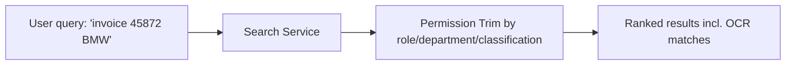

**Critical security control (from gap analysis):** search results are **permission-trimmed**. Content a user is not entitled to see never appears — not even as a snippet.

**Search engine scaling decision:**

| Volume | Recommendation |
|--------|---------------|
| Small/medium (MVP, pilot) | MySQL/PostgreSQL full-text search |
| Growing / organisation-wide | Migrate to **OpenSearch or Elasticsearch** for relevance, speed, and scale |

> **Assumption:** total document volume is currently unquantified. The volume assessment in discovery will set the threshold for the search-engine transition.

---

## 9. Physical Records Management

The system maintains the relationship between each **digital document** and its **physical original**, using a location hierarchy:

```
Building → Floor → Department → Room → Records Room → Cabinet → Shelf → Box → File
```

**Example:**

| Level | Value |
|-------|-------|
| Building | Head Office |
| Floor | 2 |
| Room | Records Room |
| Cabinet | 14 |
| Shelf | B |
| Box | FIN-2026-0145 |

A user viewing a digital record immediately sees **where the physical original is stored**, so retrieval takes seconds instead of a cabinet search.

> **Clarification from gap analysis:** the model supports **one-to-many** relationships (a box contains many files; a file may contain many documents) and **born-digital** documents that have no physical counterpart. This is confirmed during discovery.

---

## 10. Physical Document Movement

Every physical movement is tracked with a complete history.


**Captured per movement:** from location, to location, person responsible, date/time, reason, expected return date, actual return date, status.

**Checkout / check-in example:**

| Field | Value |
|-------|-------|
| Document | FIN-2026-00125 |
| Status | Checked Out |
| Checked Out By | John Smith |
| Department | Finance |
| Checked Out | 31 August 2026 |
| Expected Return | 03 September 2026 |

Overdue documents are surfaced on dashboards and can trigger reminders.

---

## 11. QR Codes and Barcodes

Every box, file, or shelf can carry a unique QR/barcode, e.g. `BOX-FIN-2026-0145`.

Scanning it displays: box information, physical location, documents contained, department, custodian, and movement history.

QR codes also **streamline movement and inventory audits** — a records clerk scans a box to check it in/out or to confirm its shelf location during a stock-take, rather than typing identifiers.

| Capability | MVP | Future |
|-----------|-----|--------|
| QR generation & lookup | ✅ | |
| Scan-to-checkout/return | ✅ (Phase 3) | |
| Mobile inventory audit | | ✅ |

---

## 12. Security & Access Control

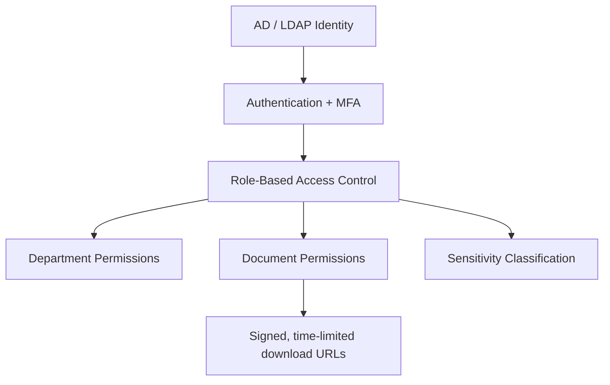

| Control | Approach |
|---------|----------|
| Authentication | AD/LDAP integration; MFA |
| Authorisation | Role-based + department-level + document-level |
| Sensitivity axis (added) | Public / Internal / Confidential / Restricted classification, independent of department |
| Encryption in transit | TLS everywhere |
| Encryption at rest | Encrypted object storage & database |
| Secure downloads | **Signed, time-limited URLs** — no permanent direct links |
| Upload safety | File-type validation + **virus/malware scanning** + quarantine |
| API security | Token authentication + rate limiting |
| Session & passwords | Session management, password policies |
| Backup & DR | Regular backups, tested restores, offsite/replicated copies |
| Search safety (added) | Permission-trimmed search results |
| Break-glass (added) | Emergency access with elevated audit |

Sensitive documents are restricted by combining **department + role + classification**, so a Confidential HR file and a Confidential Legal file are governed independently.

---

## 13. Audit & Compliance

Every significant event is recorded in an **append-only, hash-chained audit log** (tamper-evident — added from gap analysis) that is itself retained independently of document retention.

**Events captured:** created, uploaded, scanned, viewed, downloaded, printed, modified, renamed, moved, checked out, returned, archived, deleted, permission changed.

**Example audit records:**

| Timestamp | Actor | Event | Document | Detail |
|-----------|-------|-------|----------|--------|
| 2026-08-31 09:14 | j.smith | Checked Out | FIN-2026-00125 | To Finance, return by 03 Sep |
| 2026-08-31 10:02 | a.mokoena | Downloaded | HR-2026-00841 | Signed URL, 5-min expiry |
| 2026-08-31 11:20 | admin | Permission Changed | LEG-2026-00033 | Restricted to Legal only |

These logs support **compliance** (retention/access evidence), **investigations** (who did what, when), and **accountability** (movement and access history).

---

## 14. Document Lifecycle

```mermaid
flowchart LR
    C[Capture] --> I[Ingestion] --> V[Validation] --> CL[Classification]
    CL --> O[OCR] --> M[Metadata] --> ST[Storage] --> IDX[Indexing]
    IDX --> AP[Approval where required] --> AU[Active Use]
    AU --> MV[Physical Movement] --> RET[Retention]
    RET --> AR[Archiving] --> DIS[Disposal]
```

**Retention & disposition (elevated from "future" per gap analysis):** retention schedules are configurable **by document type** and can be **event-based** (e.g., "7 years after contract termination"). Disposal follows a **review-before-destroy** workflow and produces a **certificate of destruction**. A **legal hold** can freeze any document from disposal regardless of schedule — a core records-management requirement.

---

## 15. Document Versioning

The system tracks the full version history of a document.

```
Contract v1 → Contract v2 → Contract v3 → Final Approved Contract
```

For each version users can see **who created it, when, what changed, previous versions, and the current version.**

---

## 16. Workflow Automation

Future workflow capabilities are enabled by Laravel's queues, events, notifications, and scheduled jobs.

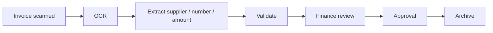

General flow: `Document scanned → OCR → Classification → Department review → Approval → Filing`.

Because processing is queue-driven, workflows run reliably in the background, retry on failure, and notify the right people at each step.

| Capability | MVP | Future |
|-----------|-----|--------|
| Queue-based ingestion/OCR | ✅ | |
| Approval workflows | | ✅ |
| Automated classification & extraction | | ✅ |

---

## 17. Scanner Integration

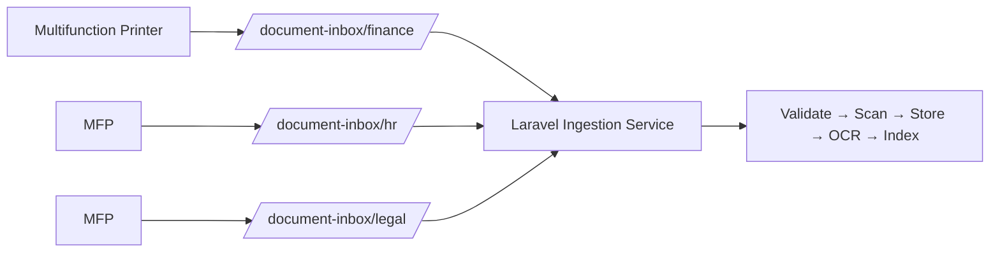

Supports scanners that write to **SMB/network folders, SFTP, FTP, email, WebDAV**, and similar. Each department has a **dedicated inbox** (e.g., `/document-inbox/finance`, `/document-inbox/hr`, `/document-inbox/legal`) so documents are automatically associated with the correct department on arrival.

A scheduled watcher **detects newly scanned files and processes them asynchronously.** Reliability safeguards (added from gap analysis):

- **File-stability check** — only ingest files that are fully written (not mid-scan).
- **Idempotency** — duplicate deposits (scanner retries) are detected via checksum.
- **Quarantine queue** — files failing validation or virus scan are held for human review, never silently dropped.
- **Batch/separator-sheet handling** — considered for high-volume scanning in later phases.

---

## 18. Infrastructure

| Component | Purpose |
|-----------|---------|
| Linux servers | Host application and services |
| Nginx | Web server / reverse proxy |
| PHP + Laravel | Application & business layer |
| MySQL/PostgreSQL | Metadata, relationships, audit |
| Redis + Horizon | Queues and background processing |
| Object storage / NAS | Encrypted document content |
| OCR processing server | Dedicated OCR workload |
| Search engine | Full-text search (later phase) |
| Backup server | Backups and disaster recovery |
| Monitoring & logging | Health, performance, and security visibility |

**Small/Medium deployment:**

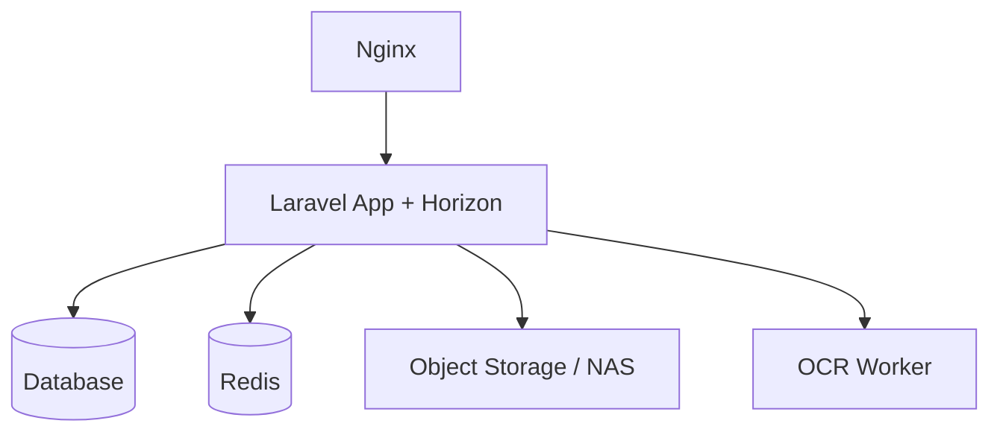

**Enterprise / High-Availability deployment:**

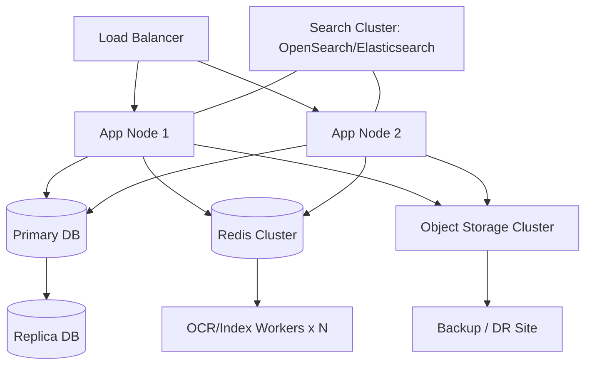

> **Assumption:** on-premise vs cloud deployment is confirmed in discovery. This decision materially affects OCR choice, storage, and HA design.

---

## 19. Integration Architecture

Laravel's REST APIs let the DRMS act as an **integration hub**.

| System | Integration value |
|--------|------------------|
| Active Directory / LDAP | Single identity source, SSO |
| Microsoft 365 / SharePoint | Content interchange, familiar tooling |
| Email | Email-to-inbox ingestion |
| ERP / Finance / HR systems | Link documents to transactions/employees |
| Existing databases | Enrich metadata |
| Network scanners / printers | Automated capture |
| SFTP / SMB | Secure file exchange |
| REST APIs | Extend to any system |

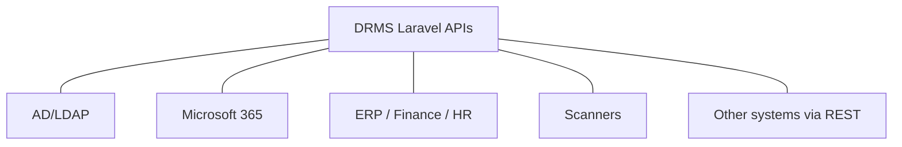

---

## 20. Reporting & Analytics

Executive dashboards and management reports include:

- Total documents; documents by department
- Documents scanned this month; OCR processing status
- Documents awaiting classification
- Documents currently checked out; overdue documents
- Documents by physical location; movement activity
- Downloads; most accessed documents
- Storage utilisation
- Documents approaching retention expiry

**Useful management reports:** overdue checkouts by department, storage growth trend, top accessed documents, retention-expiry forecast, ingestion/OCR throughput, and access-anomaly reports for security review.

---

## 21. Business Benefits

| Benefit | Business Value |
|---------|---------------|
| Productivity | Documents found in seconds by content, not minutes/hours of searching |
| Cost reduction | Less physical storage, printing, and manual administration |
| Risk reduction | Fewer lost/misplaced records; integrity verified by checksum |
| Security | Access controlled by role, department, and sensitivity |
| Accountability | Every access and movement is attributable |
| Compliance | Tamper-evident audit trails and configurable retention |
| Business continuity | Digital copies remain accessible even when physical files cannot be retrieved |
| Searchability | Find documents by their contents, not cabinet browsing |

---

## 22. ROI Framework

ROI should be calculated from the organisation's own figures gathered in discovery. The framework below shows the **method**, with **clearly labelled illustrative placeholders** — not real data.

**Inputs (to be confirmed):**

| Assumption (placeholder) | Example value |
|--------------------------|--------------|
| Staff performing document searches | *[N staff]* |
| Searches per person per day | *[S searches]* |
| Average retrieval time saved per search | *[T minutes]* |
| Fully-loaded staff cost per hour | *[C currency/hour]* |
| Annual physical storage cost | *[currency]* |
| Annual printing/copying cost | *[currency]* |
| Lost-document incidents per year | *[I incidents]* |

**Illustrative calculation (placeholders only):**

```
Annual time saved  = N × S × T minutes × working days
Annual labour value = (Annual time saved ÷ 60) × C
Total annual benefit = Annual labour value + storage savings + printing savings + risk-avoidance value
ROI = (Total annual benefit − annual platform cost) ÷ annual platform cost
```

> These formulas produce a defensible business case **once real figures replace the placeholders.** We recommend a lightweight time-and-motion sample during discovery to establish the retrieval-time baseline.

---

## 23. Implementation Roadmap

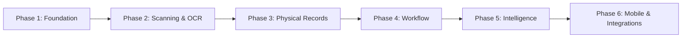

| Phase | Focus | Key Deliverables |
|-------|-------|-----------------|
| 1 — Foundation | Core platform | Infrastructure, AD authentication, departments, users, document management, storage, Nova interface |
| 2 — Scanning & OCR | Automated capture | Scanner integration, ingestion pipeline, OCR, search, metadata |
| 3 — Physical Records | Bridge to physical | Physical locations, QR/barcodes, checkout/check-in, movement tracking, inventory |
| 4 — Workflow | Process automation | Approvals, notifications, automated classification, document workflows |
| 5 — Intelligence | Structured data | Advanced OCR/IDP, structured extraction, dedicated search engine, AI-assisted processing |
| 6 — Mobile & Integrations | Reach & connectivity | NativePHP Android, ERP, Microsoft 365, other enterprise systems |

**MVP = Phases 1–2** (with Phase 3 physical records as the first high-value extension).

---

## 24. Risks & Mitigations

| Risk | Mitigation |
|------|-----------|
| Poor-quality scanned documents | Scan-quality guidelines; flag low-confidence OCR for manual correction |
| OCR accuracy below expectation | Set realistic accuracy expectations (85–98%); manual metadata correction path |
| Scanner compatibility | Assess MFP models and protocols in discovery; use inbox approach that works with any scan-to-folder device |
| Large document volumes | Queue-based async processing; horizontal worker scaling |
| Storage growth | Object storage with lifecycle tiering; monitored growth reporting |
| Security breaches | Encryption, MFA, signed URLs, virus scanning, permission-trimmed search, audit |
| User adoption | Pilot department, training, intuitive Nova UI, change management |
| Incorrect metadata | Validation rules; review workflow; future automated extraction |
| Physical records not returned | Overdue tracking, reminders, dashboards, custodian accountability |
| Integration complexity | API-first design; phase integrations; validate systems early |
| Network outages | Inboxes buffer scans; queue retries; HA option for critical deployments |
| Backup failures | Automated backups **with tested restores**; offsite/replicated copies |

---

## 25. Governance

| Area | Responsibility |
|------|---------------|
| Document ownership | Originating department |
| Department custodians | Manage their department's records |
| Records managers | Oversee retention, classification, disposal |
| System administrators | Platform operation, access, backups |
| Retention policies | Defined per document type; enforced by system |
| Access policies | Role, department, classification-based |
| Data classification | Public / Internal / Confidential / Restricted |
| Audit responsibilities | Regular audit-log review; anomaly follow-up |
| Backup policies | Scheduled backups, tested restores |
| Disaster recovery | Documented, tested DR procedures |
| Document disposal | Review-before-destroy; certificates of destruction; legal hold override |

---

## 26. Future Roadmap

The DRMS is positioned as more than a repository — an evolving **Enterprise Information Platform**.

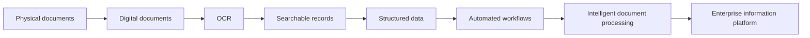

As the platform matures, **AI could assist** with document classification, metadata extraction, summarisation, duplicate detection, data extraction, document comparison, contract analysis, and intelligent search.

> **Deliberately not over-promised:** AI capabilities are framed as **assistive and future**, introduced only where they demonstrably improve accuracy or efficiency, and always subject to the same data-privacy and classification controls as the rest of the platform.

---

## 27. Conclusion

The organisation's records are among its most valuable and least accessible assets. Today they are hard to find, difficult to control, and impossible to fully audit. The proposed DRMS turns them into a secure, searchable, accountable, and continuity-ready digital platform — **without abandoning the physical originals that must be retained.**

Built on Laravel and Laravel Nova, the solution starts focused (a pilot department MVP) and scales deliberately toward intelligent document processing. It delivers measurable value in productivity, cost, risk, security, and compliance, and establishes a foundation the organisation can build on for years.

---

## Recommended Next Steps

1. **Stakeholder discovery** — align business, IT, records management, and compliance on goals and scope.
2. **Records/process assessment** — document current filing, movement, and retention practices.
3. **Document-volume assessment** — quantify volumes and growth to size infrastructure and choose the search engine.
4. **Scanner/infrastructure assessment** — inventory MFP models/protocols and existing storage.
5. **Security requirements** — confirm classification scheme, deployment model, data residency, and regulatory obligations.
6. **OCR proof of concept** — validate accuracy on real, representative documents.
7. **MVP development** — Phases 1–2 for a single pilot department.
8. **Pilot department** — controlled rollout with real users.
9. **User acceptance testing** — validate against business needs.
10. **Organisation-wide rollout** — phased expansion with training and change management.

---

### Open Questions to Resolve in Discovery

*(These materially affect scope, cost, and architecture and should be answered before committing to a full implementation.)*

1. On-premise, cloud, or hybrid deployment? Any data-residency/sovereignty rules?
2. Is cloud OCR permitted, or must OCR remain on-premise?
3. Which regulatory regimes apply (e.g., POPIA, GDPR, industry-specific)?
4. Which department is the pilot, and what are its specific needs?
5. Is structured field extraction (IDP) in the MVP or a later phase?
6. Is an existing AD/LDAP the identity source? Is SSO required?
7. Which enterprise systems are mandatory integrations vs. optional?
8. What scanner/MFP models exist and what protocols do they support?
9. Is there existing content (SharePoint/DMS) to migrate?
10. Do documented retention schedules already exist, or must they be defined?
